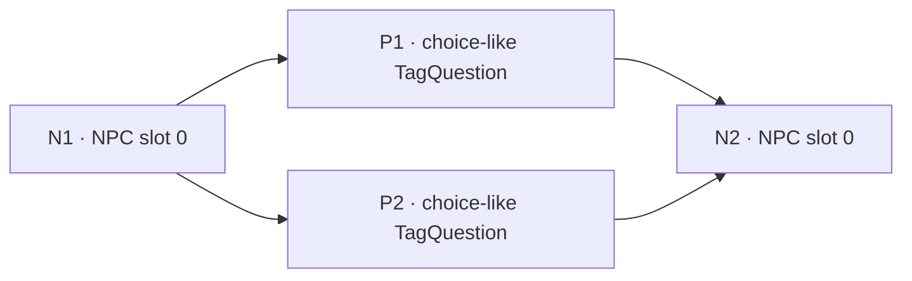

# B1-03 Dialogue Context — Phase 1 Research Foundation

日期：2026-10-08。Repository：CassiaLin/bg3loc。由 B1-02 accepted HEAD
`4bdaba0fc096e1248a7ce72d401cbb81a3e5d9bd` 建立
`feat/b1-03-dialogue-context`。B1-02 branch 保持封存。

本輪只建立 public research foundation；沒有 production material、TranslationRequest、
prompt、provider、input hash、resume、attempt、QA policy 或 B1-02 semantics 變更。
Research schema 是 `dialogue-context-evidence/1`，projection 是 `dialogue-structure/1`，
不是 `sameEntityContext` contract。

## Current parser audit

| Existing component | What it proves | What it does not prove |
| --- | --- | --- |
| `research/dialog.py` | LSJ dialog UUID、direct node UUID/constructor/speaker、nested localization handles | 沒有 child edges、speaker table、definition conflict 或 fallback origin contract；recursive handle search 本身不證明 field semantics |
| `research/context.py` | 按 ContentUid 收集跨來源 evidence | UID 聚合不是 graph occurrence identity；相同 UID 不保證相同 dialogue/node/history |
| `research/batching.py` | Deterministic group membership、UID/subkey ordering、oversize split | Grouping 與 sorting 不證明 temporal adjacency；canonicalGroupKey 不是 dialogue context |
| `commands/research.py` | Public archive discovery/conversion、dialog mappings、story occurrence ledger | In-memory story ledger 主要是角色/occurrence census；有 ordinal node fallback，但沒有完整 edges、speaker mapping 或 definition fingerprints |
| Existing schemas/tests | Generic ResearchMapping、nested LSJ handles、classification、bark review | 不提供 graph reliability policy；speakerSlot 不能直接改成角色名稱 |

新增獨立 `research/dialogue_context.py`、`dialogue_export.py` 與 public
`research dialogue-audit` CLI；沒有修改上述既有 parser／aggregator／batching semantics。
Windows 可使用 checked-in `dialogue_extract.ps1` 與 public LSLib stream API；其他平台或
沒有 pwsh 的 backend 使用既有 extract_single_file／convert_resource API。
Helper 與 schema 均包含於 wheel/sdist。

Primary public format reference：LSLib 的 [LSJ reader](https://github.com/Norbyte/lslib/blob/master/LSLib/LS/Resources/LSJ/LSJReader.cs)
與 [LSJ writer](https://github.com/Norbyte/lslib/blob/master/LSLib/LS/Resources/LSJ/LSJWriter.cs)。
它們提供 resource serialization/conversion；BG3 relation findings 則由本輪原始遊戲
resources 的 native fields 與公開 parser 重建。Serialization code 不等於 runtime dialogue evaluator。

## Structural graph model

`save.regions.dialog` 是 resource container；direct `UUID` 是 native dialogue identity。
`nodes[].node[]` 是 node table。每個 node 的 direct `UUID`、`constructor`、`speaker`，
以及 `children[].child[].UUID` 都從指定 native field 讀取，不以 recursive UUID search、
filename、XML order、ContentUid order、similarity、embedding 或 LLM judgement 推測。

下面是完全虛構、由 synthetic tests 覆蓋的 branching/merge graph：



N2 的 possible predecessors 是 P1、P2，不能選 P1 當 previous line。
N1 的 possible successors 是 P1、P2，不能選 P1 當 next line。
Child edges 證明資料中的 directed relation；flags、conditions、tag rules、choice selection、
cinematic/runtime state 仍決定某一次執行是否真的走過該 edge。Graph 不是 transcript。

| Native evidence | Research representation | Reliability boundary |
| --- | --- | --- |
| `children.child.UUID` | `edgeType=child`、potential_control_flow、native childIndex、source field provenance | Same scoped graph、native endpoints、non-conflicting definitions 才進 direct sets；不是唯一執行歷史 |
| `jumptarget` + `jumptargetpoint` | 保留 reference subtype 與原始 point | 觀察到 point 1/2；transfer/entry/stack semantics 未驗證，不當 temporal predecessor/successor |
| `Alias.SourceNode` | source-node reference | 不把 reuse reference 當 flow，不複製來源 node 的 localized occurrences 到 alias |
| `NestedDialogNodeUUID` + `SpeakerLinking` | 原始 nested reference | 本 corpus 未解析到 same-graph endpoint，也未匹配所選 dialogue UUID；external/nested runtime scope 未確定 |
| `GroupID`、`GroupIndex`、same speaker/dialogue | 留在 structural definition digest | 單獨不足以證明 localized adjacency |

Predecessors 是 verified child edges 的 reverse relation，非原始「上一句」欄位。
Successors 是 verified child references。All alternatives 保留；missing endpoint、conflict、
fallback、unsupported references 不選 winner。

## Identity and provenance contract

Join key 是 `(dialogueId, nodeId)`；node UUID 不假設跨 dialogue 全域唯一。
Native identities 依 direct field origin 判定，不靠 UUID-shaped／`node#` 字串猜測。
Native dialogue UUID 可以界定這個 build 中的 graph family，但不能單獨決定哪個
resource definition 是 authoritative，也不等於 owner、actor、runtime dialogue instance。
跨遊戲版本穩定性未驗證。

Missing dialogue UUID 使用 `resource_scope` fallback；missing node UUID 使用
`fallback_ordinal`。Fallback 明確標 origin、保留研究 evidence，不能進 reliable direct
relations。Resource provenance 是相對 archive/package identity；absolute/escaping paths
拒絕。Resource scope 與 native identity 是不同概念。

Fingerprint 使用 canonical structured JSON、SHA-256、projection version。
Node digest 保留 native controls、conditions、localized variant references、ordered children，
並綁定該 slot 的 native speaker mapping evidence，避免相同 node body 被不同 mapping 覆寫。
Dialogue digest 包含 native header fields、canonical speaker table 與 sorted node definitions。
Node/speaker table iteration order、provenance resource locators、save-header timestamps、editorData
不進 definition digest；child/variant/control arrays 可能有 selection/priority semantics，保留順序。
因此重排 node table 不改 digest，重排 native child choices 可以改 digest。

相同 native key 的所有不同 definition fingerprints 均保留；identical variants 可辨識重複。
Node 或整個 dialogue definition 衝突時，graph context 不可用。沒有 first/last/path/overlay
winner selection，也未把 missing/default/control field 差異自行正規化成相同定義。

輸出分為五份 joinable JSONL，避免每個 row 重複整張 graph：

| Ledger | Joinable evidence |
| --- | --- |
| dialogue definitions | dialogue identity/origin、definition fingerprint、sourceResource |
| node definitions | scoped node identity/origin/type/kind、speaker、fingerprint、provenance |
| localization occurrences | ContentUid/version、native LineId、fieldRole、variant fingerprint、node binding |
| edges | fromNode/toNode、native subtype/parameters、source field/resource、resolution status |
| targetEvidence | node/type/origins、all definition variants、speaker alternatives、direct sets、bounded traversal、occurrence evidence IDs |

`evidenceId` 識別 source evidence／derived target snapshot；resolved edge status 是 graph-level
derivation，不改其 source evidence ID。五份 ledger 的 semantic fingerprints 覆蓋完整輸出。
Occurrence UID 可以跨 nodes/graphs 重用；不將這些 occurrence 壓成單一 canonical history。
只解析 native TaggedText path；OldText/editor content 不另行變成 target。Native unknown-handle
sentinel 具名計數，其他不支援 handle fail closed。Ledgers 不輸出 source text。

## Speaker evidence

Direct node `speaker` 是 slot；`speakerlist[].speaker[]` 的 `index` 是 mapping key。
`SpeakerMappingId` 是 mapping evidence 的 ID，不能直接當 actor identity。
`list` 可以是一個 GUID，也可以是分號分隔的多個候選 GUID；raw mapping、SpeakerTagsIndex、
IsPeanutSpeaker 等欄位保留。Non-GUID/unresolved/special slots 不猜角色名稱。
觀察到 -1、-666 等 slots，但本輪不宣稱其 runtime 含義。

`explicit_reference` 表示 single native static reference 可解析，**不是**角色名稱或本次
實際說話者已解析。Actor/character namespace 與 runtime binding 是 PARTIAL/NOT VERIFIED。
多候選／多 mapping／不一致 definition speaker evidence 是 `ambiguous`；無法解析 mapping
是 `slot_only`；沒有 speaker field 是 `missing`。所有 variant 均保留；即使 definition
因其他 controls 衝突，仍可報共同的 speaker evidence，沒有選整個 definition winner。
Same speaker alone 不能建立上下文。

## Reliability and traversal

| Level | Meaning |
| --- | --- |
| DIRECT | Explicit verified potential child relation，保留所有 endpoints |
| AMBIGUOUS | Target 的 direct sets 有多個 predecessors/successors；底層 edges 仍是 DIRECT |
| INDIRECT | 沿 verified child edges，跨 structural-only nodes 的 bounded reachable relation |
| UNSUPPORTED | 無可靠 relation、fallback、conflict、unknown scope／reference；或僅有 ordering/grouping heuristic |

Localized、structural_only、unknown 分開分類。有 native localization handle 才是 localized；
known controls（Jump、Visual State、RollResult、PassiveRoll、FallibleQuestionResult、Nested Dialog、
Trade）沒有 localized field 時保留為 structural-only。Alias/Pop 或其他未證實類型保持 unknown，
不文字化，也不自動跳過。包含 text 的 ActiveRoll 保留 localized variants。

Direct localized neighbours 與透過 controls 可達的 nearest localized neighbours 分開。
Research traversal 預設最多8 hops、每條 branch 都保留，遇 localized node 停止該 branch，
unknown node 停止，保留 revisitedNode／boundReached／blockedUnknown 訊號。
這是 finite graph reachability research，不是 production hop budget 或 runtime path policy。
Jump/alias/nested references 不參與 flow traversal。

## Public reproducibility

設定 public archive backend（例如環境變數 BG3LOC_DIVINE_EXE/BG3LOC_DIVINE_DLL）；
不需 private repo、manual node list、retained secret artifact、real UUID hardcode 或 provider。

```powershell
python -m bg3loc research dialogue-audit --game-dir "$env:BG3_GAME_DIR" --output-dir workspace/dialogue-research
```

Optional `--classification` 接公開 research classify／production prepare 所產的
functional-classification JSONL，只估算 classified dialogue_general/bark targets。
Classification path 不進 output fingerprint；其 SHA256 與 game corpus identity 記錄於 summary。
沒有該輸入仍可重建所有 dialogue research evidence。

CLI 動態列出 Data 下 primary archives，保留所有 raw/binary definitions；multipart continuation
由 base archive 讀取並計數。Unreadable primary、selected extraction/conversion failure、count
mismatch、malformed native structure fail closed。Windows optimized extraction 的 raw cache
只在本輪產生，處理完移除；portable path 同樣使用 user's archives。沒有 external translation call。
本輪正式 run 重新從遊戲安裝抽取，沒有以 P2/P4/P5 retained dialogue evidence 當研究來源。
Coverage denominator 使用同 build 的 accepted P5 classification，僅讀取、未改 production workspace。

## Real corpus aggregate

正式 public CLI fresh run：game build `25605617`、version `4.1.1.7631656`。動態抽取
18,757 resources：9,371 LSJ／9,386 LSF；22 multipart continuations 由 base
archive 讀取。每個 selected resource 成功解析，沒有 retained raw cache 或 provider。

| Metric | Count |
| --- | ---: |
| Unique native dialogue families | 9,376 |
| Scoped nodes | 187,004 |
| Node definition variants | 216,475 |
| Source localization occurrence records | 352,465 |
| Unique localized occurrences (dialogue/node/UID/LineId/variant) | 176,854 |
| Localized nodes | 143,340 |
| Structural-only nodes | 27,237 |
| Unknown/non-localized nodes | 16,427 |
| Native non-conflicting graph nodes usable for direct relation | 40,934 |
| Nodes with direct predecessor | 30,579 |
| Nodes with direct successor | 25,684 |
| Nodes with >1 direct predecessor | 2,126 |
| Nodes with >1 direct successor | 3,714 |
| Identical duplicate dialogue variants | 5,746 |
| Identical duplicate node variants | 157,518 |
| Conflicting dialogue families | 3,631 |
| Conflicting scoped nodes | 29,453 |

Node kind/type census 使用 all definition variants 的一致欄位，不從 conflicting definition
挑 winner。Single native speaker reference 不等於 resolved character name：

| Speaker evidence | All scoped nodes | Localized nodes |
| --- | ---: | ---: |
| Explicit single static reference | 123,281 | 117,763 |
| Slot-only / unresolved mapping | 19,242 | 8,832 |
| Missing field | 26,668 | 0 |
| Ambiguous alternatives / inconsistent definition speaker | 17,813 | 16,745 |

| Direct localized neighbour count | Predecessor | Successor |
| --- | ---: | ---: |
| Exactly one | 19,612 | 15,108 |
| Multiple alternatives | 1,399 | 2,269 |
| None / unavailable | 122,329 | 125,963 |

Denominator 是 143,340 localized nodes，含因 conflict 不可供 context 的 nodes。
Branching rate 以全部 187,004 nodes 為分母：>1 predecessor 1.136874%、>1 successor
1.986054%；以 40,934 usable nodes 為分母，分別5.193726%／9.073142%。
不可用全域低 branching rate 推論每個 graph 都能安全採「前一句／後一句」。

Through structural-only nodes 的 nearest-localized research 有 1,682 localized
nodes 找到 >1-hop candidates，與 direct count 分開，最多8 hops，flags/conditions仍未求值。
35,467 localized TagQuestion nodes；verified direct localized TagQuestion→TagAnswer pairs
5,039，233 TagAnswer nodes 有多個 TagQuestion predecessors。這證明 choice-like localized
structure 可以 branching/merge，但不證明某次 player 選項、NPC actor或唯一 response history。

417,563 source edge records：child363,719、jumptarget38,498、SourceNode14,210、
NestedDialogNodeUUID1,136。Resolution records為DIRECT68,279、reference_only7,589、
conflict_or_fallback340,559、missing_endpoint1,136。Source records 可因 raw/binary duplication
重複；direct neighbour sets 已去重。Nested references 的 unresolved scope不轉成fake edge。
Jump point 1／2分別27,954／10,544 source records，保留但不解析其 runtime transfer semantics。
100 unknown-handle sentinel definition variants 被具名計數，不轉成 localized text occurrence。

### Production dialogue coverage estimate

使用同 build 的 accepted P5 classified inventory：dialogue_general166,036、bark9,894，
共175,930。Graph observation涵蓋175,844 targets；有至少一個 verified direct localized
relation的 occurrence 對應27,956 targets。要求同 UID 的所有 occurrences 有一致、唯一
scoped node definition/relation signature，且沒有 missing relation，得到27,951 reliable
unambiguous targets，147,979 without，**15.887569%**。保守 estimate排除5個跨 occurrence
不一致 targets；沒有把所有同 dialogue/同 speaker targets計為 covered。

這只是 structural estimate：未將 neighbour English availability、選項/variant conditions、
source text budgets 或 runtime history當成已通過 production policy。未寫入 production material。
Classification byte SHA256：`6fe2d8266ff3ce2179d5555cf89f9e6b158eba4356efc2bfb2d43789e76e143b`。

### Deterministic ledgers and final gates

Canonical output semantic fingerprints：

| Ledger | SHA256 |
| --- | --- |
| dialogue | `e630092da42fb17f30c1ddefd80950f0743230e021f6fc18c59ccdecf83d813b` |
| edge | `3b5e2afb42a61ed977ff9e304f217ce15836c6a033ae593042e5c4c93f66a8ac` |
| node | `6f56b571d6a58ed879a97fdaa7f023892cf983fd9784714a716d4260fdb9b104` |
| occurrence | `65ff3f9be050402779980753ff7b48d6b9a540992468b1df9821ce607f09e31e` |
| targetEvidence | `8116e58acb9930d1c1355f91b9c2e079ea039b4cb5e6619b47a2c5161c436fa4` |

Real output全部 1,306,207 records通過新增schema，failures0：dialogue18,757、
node374,082、occurrence352,465、edge417,563、targetEvidence143,340。
Synthetic input reorder/repeat output byte equality、native/fallback origins、branch/merge、
speaker alternatives/closure、reference subtypes、bounded traversal、conflict retention均通過。

Targeted **131 passed**；full regression **847 passed, 75 subtests passed, 0 warnings**
（baseline809 passed）。Wheel／sdist build成功，包含research helper與schema；CLI help/import
smoke通過。Protected production files的diff為empty；provider calls0。
Privacy audit只提交research code、schemas、fictional fixture generators/tests與aggregate docs；
沒有真實dialogue text、mass ContentUid/dialogueUuid/nodeUuid、私人路徑、workspace/DB或secrets。

## Candidate policies — decision remains open

| Candidate | Evidence / potential benefit | Risk / prerequisite |
| --- | --- | --- |
| A · direct localized sets only | Non-conflicting native graph 的 direct predecessor/successor localized alternatives | 必須顯示 possible alternatives；UID 多 occurrence、conditional selection、variant text、budget仍需 policy；不能指定唯一前後句 |
| B · bounded child traversal through controls | 另加入跨 structural-only nodes 的 reachable localized sets | Cycle/convergence/unknown/bound signals、path conditions 與 control runtime semantics 尚需決策；不跨 jump/alias/nested references猜 history |
| C · A plus static speaker evidence | Slot relation與 verified single reference／explicit alternatives | Actor namespace、runtime binding與角色名稱尚未證實；speaker不能授權新增 target 沒有的資訊 |

未實作任何 production policy。未來 dialogue context 必須 source-side only、read-only；
target source remains sole translation target，context 不能授權補寫資訊。
可沿用 provenance/fingerprint/prepare-time materialization 哲學，但須獨立 dialogueContext
contract，不硬套 B1-02 same-entity fields。

## Limitations and next decision

Native structural evidence 足以重建 possible child relations，不足以還原唯一 transcript。
Raw/binary definitions 有衝突；有缺省 fields 差異，也有 flags/controls/text/speaker/child 差異，
不能自行挑 runtime winner 或把差異視作無害。Current conservative whole-dialogue conflict gate
降低估計 coverage；此數字不是未来 production coverage、翻譯品質提升或 runtime path 驗證。
Source English availability／variant selection、speaker角色名稱、nested scope、jump point/alias
semantics、跨版本 stability，仍需獨立決策或後續 evidence。No heuristic/LLM inference。

本輪停止於研究 foundation；下一步應先決定 reference/occurrence/conflict 與候選 policy 的
research acceptance，才另行授權 production design。沒有開始 production integration。

## Phase 1 decision

```text
B1-03 Dialogue Context Research Foundation = READY
Production Integration = NOT STARTED
```

READY只表示public研究結構、provenance、fixtures、real aggregate與reproducibility已建立。
Production policy、material contract、runtime semantics與翻譯品質尚未驗證或實作。
